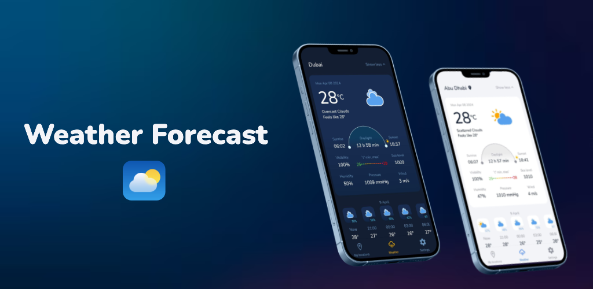
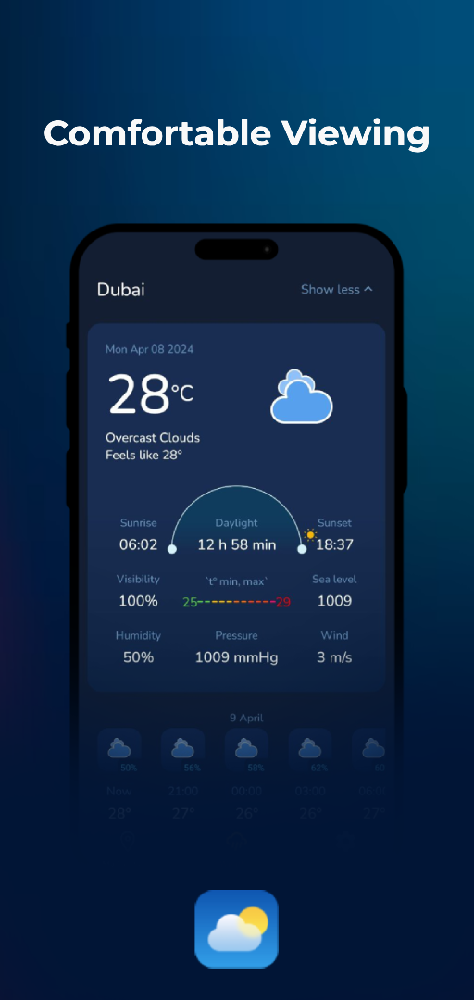
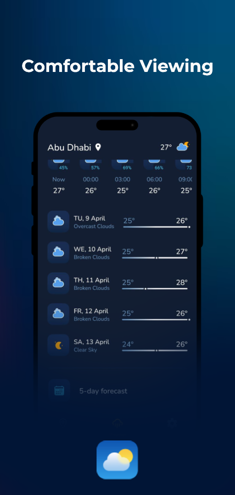
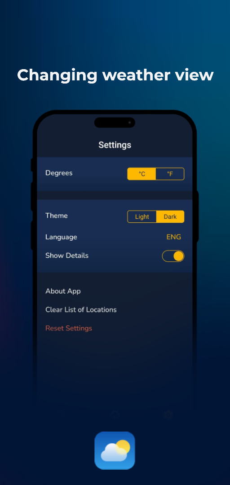
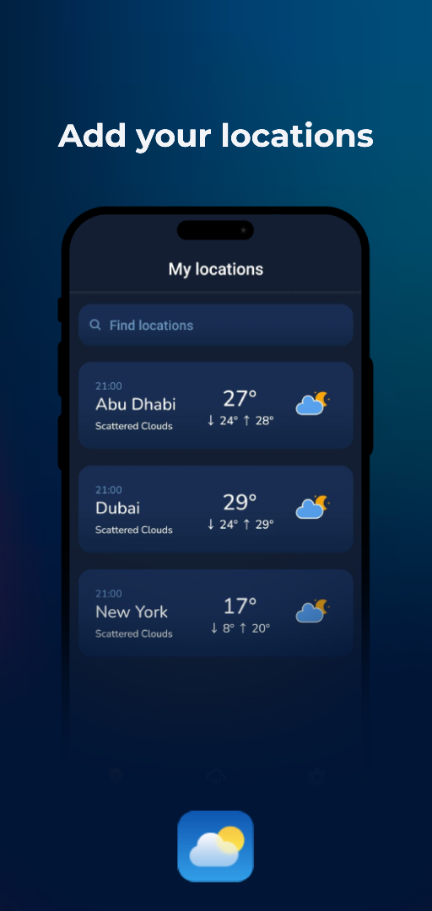
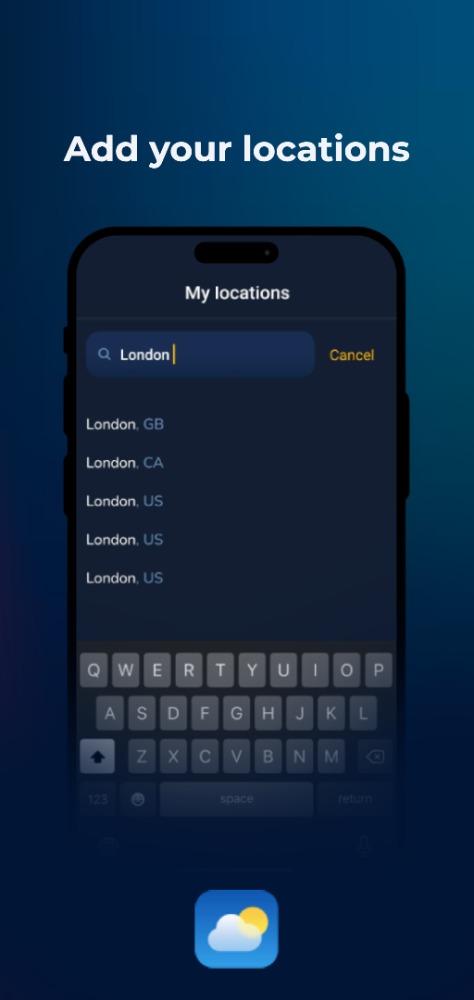
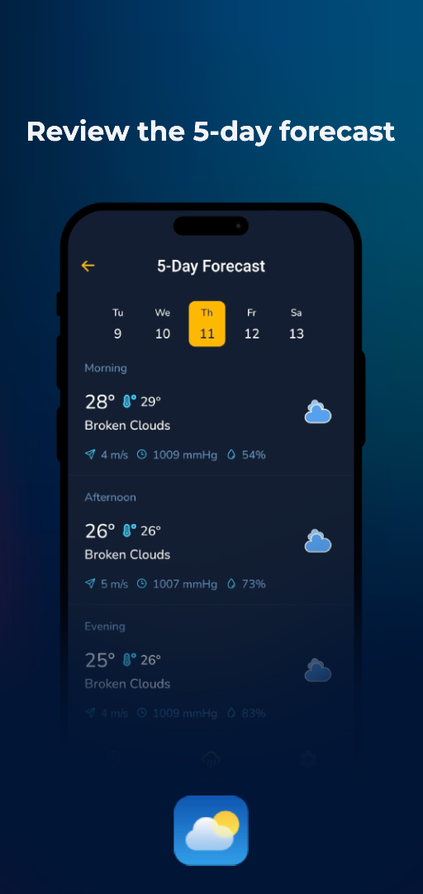

# 💻 Weather Forecast

  

Weather Forecast is an app that helps you stay up to date with weather conditions. Get up-to-date weather information for today, tomorrow and next week. The app provides accurate forecast of temperature, humidity, wind and other weather parameters for your location.

## Key features

### A detailed view of the weather

You can view all detailed information about the current weather in the Weather page, such as hourly weather, 5-day weather and current weather.

### View and store multiple locations

You can add multiple locations to the application and easily view and switch between them.

### Possibilities to control the weather and interface

The application has the ability to switch the current theme, switch between languages in particular - English, Russian and Ukrainian, getting data in Celsius and Fahrenheit, as well as clearing all locations and resetting settings.

### Daily weather forecast for 5 days

In the application there is an opportunity to see the weather forecast for 5 days with convenient functionality and interface. 

### Hourly forecast for accurate weather preparation

In the app there is an option to view the weather forecast by hour with a view of detailed weather information.

## Why Choose Weather Forecast:

Weather Forecast utilizes the latest technology to provide the most accurate weather forecast. With a simple interface and user-friendly features, you'll always be prepared for any weather condition.

## Download From Google Play

### Download Weather Forecast now and get access to the most accurate weather forecast for your area!

[**🔗Click here!**](https://play.google.com/store/apps/details?id=com.fairy.weather)

  
  
  
  
  
  

